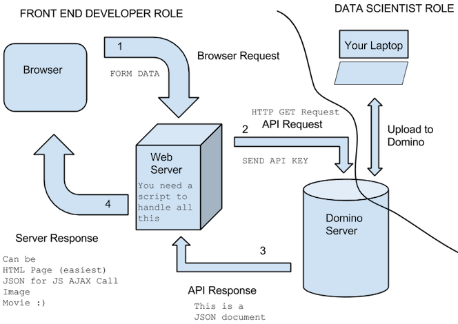

## Agenda

A short presentation and then a **demo**:

- About Us
- Intro
- The Problem: Operationalizing Predictive Models
- Solutions
- Case Study: Iris Flower Predictor
- Demo
- Q & A

## About Us

- **Daniel Emaasit** (Ph.D. Student)  
Use R for statistical programming in my research to solve Transportation Engineering problems like crashes, congestion e.t.c.
    + Github: [https://github.com/Emaasit](https://github.com/Emaasit)
    + Email: [daniel.emaasit@gmail.com](mailto:daniel.emaasit@gmail.com)
    + Website: [http://www.danielemaasit.com](http://www.danielemaasit.com)

- **Steve Wells** (C.T.O, Cumulus)  
Computer Programmer & Data Scientist
    + Github: [https://github.com/yxes](https://github.com/yxes)
    + Email: [yxes@cpan.org](mailto:yxes@cpan.org)
    + Website: [http://www.stephendwells.com/](http://www.stephendwells.com/)

## Intro

Common examples of data products:   

- Loan/credit approval
- Recommendation systems (Movies, products, news feed)
- Quoting premiums; claims estimates
- Churn reduction/ Customer retention  


## The Problem: Operationalizing Predictive Models (1/2)


- Data scientists may not be good at web programming or app dev  
- Software enginners may not be good at machine learning


## The Problem: Operationalizing Predictive Models (2/2)

- Different languages are good for different tasks


## Solutions
1. Translate code
2. Predictive API Engines
     + [Domino Data Labs](http://dominodatalab.com)
     + [Yhat](https://www.yhathq.com)
     + [PredictionIO](https://prediction.io)
     + [Microsoft AzureML](https://azure.microsoft.com/en-us/services/machine-learning)
     + [BigML](https://bigml.com)
     + [Revolution Analytics DeployR](http://deployr.revolutionanalytics.com)
     + [Sense](https://sense.io)
     

## Why Use Predictive API Engines
- I do not have time/skills for every single task
- I want to focus on understanding my problem and improving models


## Predictive API Engines, Part 1: Domino Data Lab

     
## How Domino Works


- Data scientists focus on developing & improving models  
- Software enginners focus on maintaining the apps


## Demo
- 1st: Use random forests to predict the flower species in the iris dataset
- 2nd: Turn the model into a web service
- 3rd: Call the web service in a sample app
```{r table1, results='asis'}
library(xtable)
data(iris)
print(xtable(head(iris, 5)), type = "html", include.rownames = F)
```

## Let's Do it together
- Create a free account on [dominodatalab.com](http://dominodatalab.com)
- Fork my project from my account [https://app.dominodatalab.com/SparkIQLabs/helloWorld](https://app.dominodatalab.com/SparkIQLabs/helloWorld)


## Simple WebSever Application


## Action Shot

**Web Sample**
[http://bit.ly/1YPQFJu](http://bit.ly/1YPQFJu)

*supplied by heroku*

or run it yourself

**Github**
[http://github.com/yxes/domino_iris](http://github.com/yxes/domino_iris)

## Relevant Code (1/2) | Formulate Request

```{python, eval=FALSE}
MODEL_ATTRS = [ 'sepal_length', 'sepal_width', 
                'petal_length', 'petal_width' ]
                
if request.method == 'POST': # you submitted the form

        attributes = [] # just the values from the form in an array
        for field in MODEL_ATTRS:
###<b>
            attributes.append(request.form[field])
        result = fetch_score(attributes)
###</b>
        result = result.json()
```

## Relevant Code (2/2) | API Call 

```{python, eval=FALSE}
### <b>
API_KEY = 'KaxzbZ3bu1VNF7yUpQ3TmtUl6reJjp6xjHLoCnPUhsVbrE6nJ9wjGg31FW6cCDcZ'
### </b>

def fetch_score(attributes):
    return requests.post(
### <b>
        "https://app.dominodatalab.com/v1/SparkIQLabs/helloWorld/endpoint",
### </b>
        headers = {
            'X-Domino-Api-Key': API_KEY,
            'Content-type': 'application/json'
        },
        json={ "parameters": attributes }
)
```

## Best Practices for Using a Predictive API Engine
- Separate training, initialization, and prediction
- Make prediction functions thread-safe
- Leverage persistence/serialization tools (e.g. pickle)


## What your Predictive API Engine should have for Production
- Very low latency
- Zero-downtime upgrades
- High availability
- Reproducibility
- Logging
- Security


## Thank you
- **Daniel Emaasit**
    + Github: [https://github.com/Emaasit](https://github.com/Emaasit)
    + Email: [daniel.emaasit@gmail.com](mailto:daniel.emaasit@gmail.com)
    + Website: [http://www.danielemaasit.com](http://www.danielemaasit.com)


- **Steve Wells**  
    + Github: [https://github.com/yxes](https://github.com/yxes)
    + Email: [yxes@cpan.org](mailto:yxes@cpan.org)
    + Website: [http://www.stephendwells.com/](http://www.stephendwells.com/)
    
- **Slides available here**:
    + Github: [https://github.com/yxes/domino-iris](https://github.com/yxes/domino-iris)