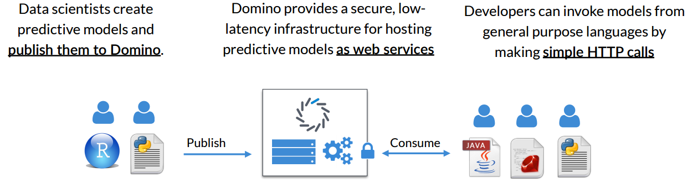

## Agenda

A short presentation and then a **demo**:

- About Us
- Intro
- The Problem: Operationalizing Predictive Models
- Solutions
- Case Study: Iris Flower Predictor
- Demo
- Q & A

## About Us

- **Daniel Emaasit** (Ph.D. Student)  
Use R for statistical programming in my research to solve Transportation Engineering problems like crashes, congestion e.t.c.

- **Steve Wells** (C.T.O, Cumulus)  
Jack of all trades: Computer Programmer & Data Scientist

## Intro

Common examples of data products:   
- `Loan/credit approval`  
- `Recommendation systems (Movies, products, news feed)`  
- `Qouting premiums; claims estimates`  
- `Churn reduction/ Customer retention`  

## The Problem: Operationalizing Predictive Models (1/2)

- Data scientists may not be good at web programming or app dev  
- Software enginners may not be good at machine learning

## The Problem: Operationalizing Predictive Models (2/2)

- Different languages are good for different tasks

## Solutions
1. Shiny
2. Predictive API Engines
     + [Domino Data Labs](http://dominodatalab.com)
     + [Yhat](https://www.yhathq.com)
     + [PredictionIO](https://prediction.io)
     + [Microsoft AzureML](https://azure.microsoft.com/en-us/services/machine-learning)
     + [BigML](https://bigml.com)
     + [Revolution Analytics DeployR](http://deployr.revolutionanalytics.com)
     + [Sense](https://sense.io)

## Why Use Predictive API Engines
- I do not have time/skills for every single task
- I want to focus on understanding my problem and improving models

## 
- Part 1: Domino Data Lab
     
## How Domino Works

- Data scientists focus on developing & improving models  
- Software enginners focus on maintaining the apps

## Demo

## Best Practices for Using a Predictive API Engine
- Separate training, initialization, and prediction
- Make prediction functions thread-safe
- Leverage persistence/serialization tools (e.g. pickle)

## What your Predictive API Engine should have for Production
- Very low latency
- Zero-downtime upgrades
- High availability
- Reproducibility
- Logging
- Security

## Try it Yourself
- Create a free account on [dominodatalab.com](http://dominodatalab.com)
- Fork my project on my account 

## Thank you
- **Daniel Emaasit** (Ph.D. Student)  
Use R for statistical programming in my research to solve Transportation Engineering problems like crashes, congestion e.t.c.

- **Steve Wells** (C.T.O, Cumulus)  
Jack of all trades: Computer Programmer & Data Scientist